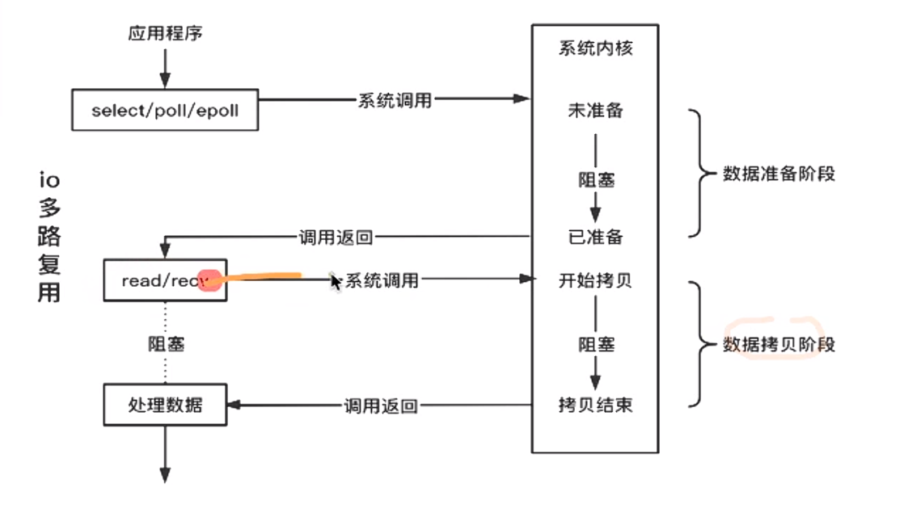
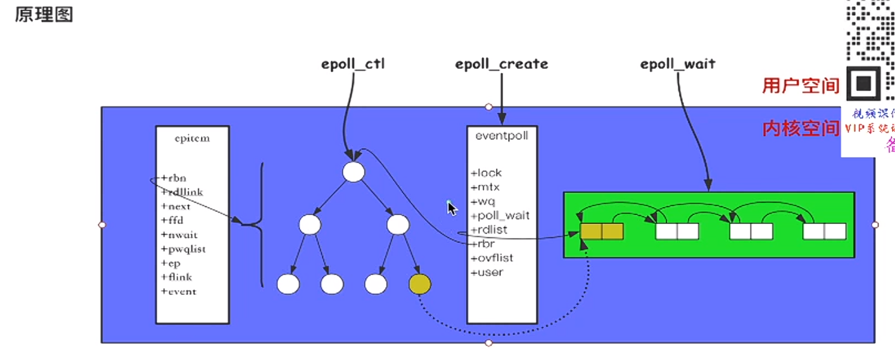

write和read这类IO函数的真正使用都只占连接的生命周期的小部分，绝大部分是空闲的，对服务器资源造成巨大浪费

IO多路复用：就是用一个线程去检测不同连接的IO事件
1. 多路：指的是多条连接
2. 复用：复用一个线程

基于事件驱动思想，底层使用红黑树保存我们感兴趣的IO事件，每一条连接对应树种的一个节点

每一个epoll对象都会有一棵红黑树和就绪队列，epoll原理：

epoll_create  -> epoll_ctl -> epoll_wait

select, poll与epoll的详细原理和区别请参考《UNIX网络编程：卷1》第二部分第六章，游双《Linux高性能服务器编程》第九章

write和read默认阻塞：对于阻塞式套接字（例如 TCP 套接字）和管道（pipe），write 和 read 函数在默认情况下是阻塞的。
1. 当调用 write 函数向套接字或管道写入数据时，如果缓冲区已满或者对端没有读取数据，write 函数会阻塞，直到数据能够被写入。
2. 当调用 read 函数从套接字或管道读取数据时，如果缓冲区为空或者对端没有写入数据，read 函数会阻塞，直到数据可用或者连接被关闭。

可以通过设置文件描述符的属性或使用非阻塞模式来改变其行为：
1. 设置文件描述符为非阻塞：
可以使用 fcntl 函数或 ioctl 函数将文件描述符设置为非阻塞模式。例如，使用 fcntl(fd, F_SETFL, O_NONBLOCK) 将文件描述符 fd 设置为非阻塞模式。
2. 非阻塞特性：
当文件描述符处于非阻塞模式时，write 函数会尽力写入尽可能多的数据，但如果无法一次写入所有请求的数据，会立即返回，并返回错误码 EAGAIN 或 EWOULDBLOCK 表示操作会阻塞。
当文件描述符处于非阻塞模式时，read 函数在没有数据可读或已经读取到文件末尾时，会立即返回，并返回错误码 EAGAIN 或 EWOULDBLOCK 表示操作会阻塞。